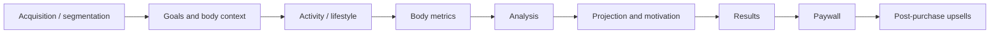
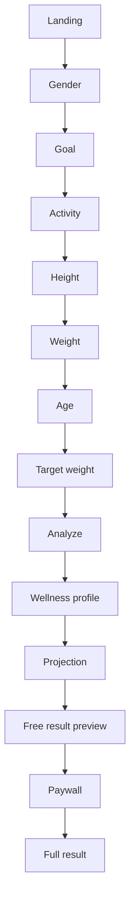

# Reference funnel audit

## 1. Reference

Primary product reference:

- BetterMe-style Web-to-App assessment funnel described by the challenge.
- A captured reference implementation containing roughly 69 screens, multiple conditional branches, a paywall, and post-purchase upsells was used to understand the full product rhythm.

This repository does not copy third-party source code, visual assets, or copywriting. The reference is used only to identify reusable interaction and data-flow patterns.

## 2. What the long funnel is really doing

A 60+ screen funnel looks large at the presentation layer, but its underlying product model can be compressed into a small number of phases:



For this challenge, only the technically meaningful subset is retained.

## 3. Reference mechanics worth preserving

### 3.1 Ask -> derive -> give value

A weak questionnaire asks for many fields in sequence and provides nothing until the end.

The reference funnel instead alternates between information collection and feedback. This creates a perception that each answer improves personalization.

Our compressed version follows the same principle:

```text
collect body metrics
    -> derive BMI feedback
collect goal state
    -> derive weight delta / trajectory
complete assessment
    -> create wellness profile + projection
    -> show partial result
    -> paywall
```

### 3.2 Projection as payoff

The target-date projection is not treated as a hidden backend number. It becomes a visible explanation of how current state, goal, and activity are transformed into a personalized future estimate.

### 3.3 Value before paywall

The free user should see a meaningful, trustworthy result preview. However, values selected as premium must not be present in the free API response.

### 3.4 Conditional funnel semantics

The captured reference contains conditional paths. Our first release intentionally has a mostly linear path, but step identity is modeled with stable keys rather than numeric positions so conditions can be added without changing the meaning of persisted progress.

## 4. What is deliberately removed

The following reference-funnel patterns are not useful enough for this challenge to justify their implementation cost:

- repeated social-proof screens;
- extensive nutrition/lifestyle questioning unrelated to required output;
- marketing email/name capture;
- artificial long-running analysis animations;
- discounts and countdown timers;
- checkout pricing experiments;
- post-purchase upsells;
- app-download handoff.

## 5. Compressed product flow



## 6. Screen-to-data mapping

| Screen | Input | Persisted | Derived output | Technical responsibility |
|---|---|---:|---|---|
| Landing | none | session/assessment | none | anonymous session bootstrap |
| Gender | gender | yes | none | validation + save-step |
| Goal | goal | yes | none | validation + save-step |
| Activity | activity level | yes | none | validation + save-step |
| Height | height | yes | none | numeric validation |
| Current weight | weight | yes | optional BMI preview | numeric validation |
| Age | age | yes | none | range validation |
| Target weight | target weight | yes | weight delta | semantic validation |
| Analyzing | none | no | full calculation | submit use case |
| Wellness profile | none | result snapshot | BMI/category | result projection |
| Projection | none | result snapshot | target date | result projection |
| Free result | none | no | partial result | subscription policy |
| Paywall | simulated payment | payment event | active subscription | idempotency |
| Full result | none | no | full result | subscription policy |

## 7. Design implication

The UI is not the system of record. It is a projection of server-owned assessment state.

The reference funnel therefore informs the backend architecture in concrete ways:

- answers are incremental server state;
- resumable progress is derived from those answers rather than duplicated as a persisted `currentStepKey`;
- transitions and cross-field dependencies are validated server-side;
- result generation happens after a complete assessment;
- result data is snapshotted;
- subscription access is projected on the server;
- browser refresh must be recoverable without relying on client-only state.
