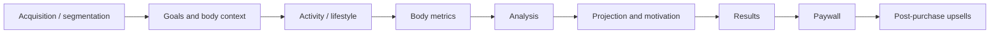
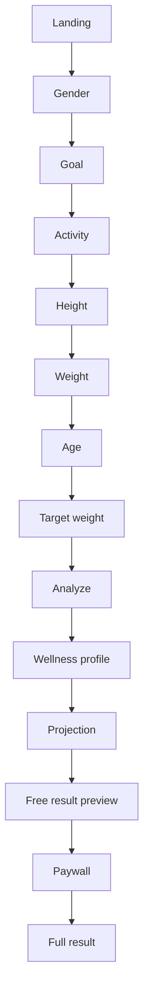

# 参考漏斗审计

## 1. 参考来源

主要产品参考：

- 挑战中描述的 BetterMe 风格 Web-to-App 评估漏斗。
- 捕获的参考实现包含约 69 个屏幕、多个条件分支、一个付费墙和购买后追加销售，用于理解完整的产品节奏。

本仓库不复制第三方源代码、视觉素材或文案。参考仅用于识别可复用的交互和数据流模式。

## 2. 长漏斗的实际作用

一个 60+ 屏幕的漏斗在展示层看起来很大，但其底层产品模型可以压缩为少量阶段：



对于本次挑战，仅保留技术上有意义的子集。

## 3. 值得保留的参考机制

### 3.1 提问 -> 推导 -> 给予价值

一个薄弱的问卷会按顺序要求填写许多字段，并且直到最后才提供任何内容。

参考漏斗则在信息收集和反馈之间交替进行。这创造了一种感知，即每个答案都能改善个性化程度。

我们的压缩版本遵循相同的原则：

```text
collect body metrics
    -> derive BMI feedback
collect goal state
    -> derive weight delta / trajectory
complete assessment
    -> create wellness profile + projection
    -> show partial result
    -> paywall
```

### 3.2 预测作为回报

目标日期预测不被视为隐藏的后端数字。它成为一种可见的解释，说明当前状态、目标和活动如何转化为个性化的未来估计。

### 3.3 付费墙前提供价值

免费用户应该看到有意义、可信的结果预览。但是，被选为付费内容的值不得出现在免费 API 响应中。

### 3.4 条件漏斗语义

捕获的参考包含条件路径。我们的第一个版本故意采用基本线性的路径，但步骤身份使用稳定键而非数字位置建模，以便在不改变已保存进度含义的情况下添加条件。

### 3.5 访客身份与问卷/订单身份

2026-09-12 对提供的 BetterMe 流程进行的实时浏览器检查表明，可见的 `order` 查询参数并非完整的浏览器身份模型。首次访问 `onboarding?flow=1453` 时首先接收一个 `session_uuid` cookie 并进入无 `order` 参数的首屏体验。选择第一个答案会通过 `POST /api/v3/questionnaires` 创建问卷；返回的 UUID 随后被放入 `?order=<uuid>` 中。在干净的浏览器上下文中打开相同的 `order` URL 并未恢复之前的问卷状态，这表明 URL 标识符本身不应被视为持有者凭证。

因此，挑战采用了有用的分离方式，而非克隆 BetterMe 内部实现：HttpOnly cookie 仍然是匿名浏览器会话的权威来源，而评估 UUID 作为不透明的 `order` 关联标识符暴露在 URL 中。过期/外来的 `order` 参数无法选择其他会话；页面会规范化回当前 cookie 拥有的 order。

为了导航延迟，落地页在后台开始匿名引导，Next.js 预取评估路由。引导结果在短暂的交接窗口内可复用，因此点击 CTA 通常无需等待第二个顺序评估请求即可渲染第一个必需步骤。这故意使挑战评估比观察到的 BetterMe 问卷创建时刻稍早；这是一个小范围的性能权衡，而非试图精确重现 BetterMe 的后端生命周期。

## 4. 故意移除的内容

以下参考漏斗模式对于本次挑战而言不够有用，不值得为其投入实现成本：

- 重复的社会证明屏幕；
- 与所需输出无关的大量营养/生活方式问答；
- 营销邮件/姓名获取；
- 人为的长时间分析动画；
- 折扣和倒计时计时器；
- 结账定价实验；
- 购买后追加销售；
- 应用下载交接。

## 5. 压缩的产品流程



## 6. 屏幕到数据映射

| 屏幕 | 输入 | 已持久化 | 派生输出 | 技术职责 |
|---|---|---:|---|---|
| Landing | none | session/assessment | none | 匿名会话引导 |
| Gender | gender | yes | none | 验证 + 保存步骤 |
| Goal | goal | yes | none | 验证 + 保存步骤 |
| Activity | activity level | yes | none | 验证 + 保存步骤 |
| Height | height | yes | none | 数值验证 |
| Current weight | weight | yes | optional BMI preview | 数值验证 |
| Age | age | yes | none | 范围验证 |
| Target weight | target weight | yes | weight delta | 语义验证 |
| Analyzing | none | no | full calculation | 提交用例 |
| Wellness profile | none | result snapshot | BMI/category | 结果预测 |
| Projection | none | result snapshot | target date | 结果预测 |
| Free result | none | no | partial result | 订阅策略 |
| Paywall | simulated payment | payment event | active subscription | 幂等性 |
| Full result | none | no | full result | 订阅策略 |

## 7. 设计含义

UI 不是记录系统。它是服务器拥有的评估状态的投影。

因此，参考漏斗以具体方式指导后端架构：

- 答案是增量服务器状态；
- 可恢复的进度派生自这些答案，而非作为已持久化的 `currentStepKey` 重复存储；
- 转换和跨字段依赖在服务器端验证；
- 结果生成在完整评估后发生；
- 结果数据被快照；
- 订阅访问在服务器端投影；
- 浏览器刷新必须可恢复，不依赖仅客户端状态。
