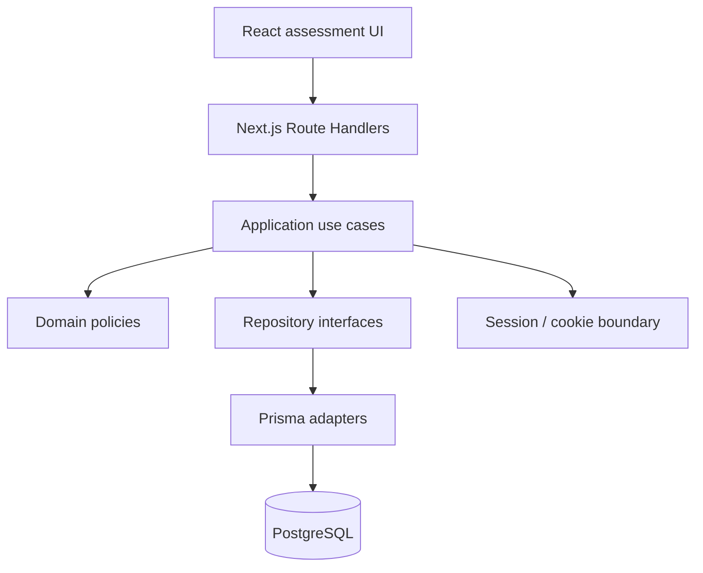
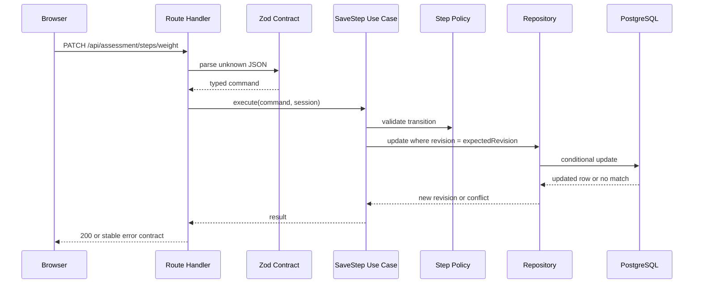
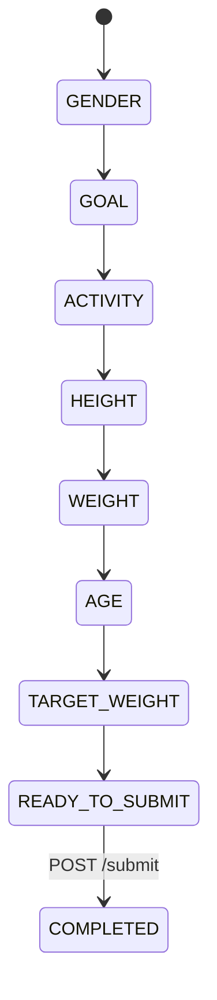
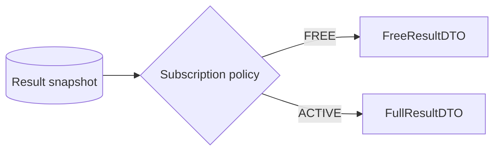

# 系统架构

## 1. 架构风格

本项目采用基于 Next.js 构建的小型模块化单体架构。

这是一个经过慎重考量的时效性决策：单一代码仓库、单一应用部署、单一 CI 流水线和单一数据库连接，在降低集成开销的同时，仍然保持传输层、应用层、领域层和持久化层之间清晰的边界。



## 2. 依赖方向

依赖指向内部：

```text
app / HTTP adapters
        -> application
              -> domain
              -> repository ports
infrastructure
        -> repository ports
```

领域层不得导入：

- Next.js；
- React；
- Prisma；
- cookies；
- 环境变量；
- 直接使用系统时钟时间。

## 3. 已实现的源码目录结构

```text
src/
├── app/
│   ├── assessment/
│   ├── result/
│   └── api/
│       ├── session/
│       ├── assessment/
│       │   ├── route.ts
│       │   ├── steps/[stepKey]/
│       │   ├── submit/
│       │   └── result/
│       └── pay/
├── components/
│   └── assessment/
├── contracts/
│   └── api-error.ts
├── modules/
│   ├── assessment/
│   │   ├── application/
│   │   ├── contracts/
│   │   ├── domain/
│   │   └── infrastructure/
│   └── session/
│       ├── application/
│       ├── domain/
│       ├── http/
│       └── infrastructure/
├── lib/
└── test/
    ├── unit/
    ├── integration/
    └── e2e/
```

## 4. UI 体系与组件归属

表现层使用 **Tailwind CSS + shadcn/ui（基于 Base UI 原语）**。

shadcn/ui 被视为共享 UI 原语的本地源码，而非黑盒依赖。项目遵循库优先规则：

1. 检查是否已有合适的 shadcn/ui 组件；
2. 通过 CLI 添加基于 Base UI 的 shadcn 组件；
3. 在产品需求要求时，自定义其本地实现或变体；
4. 从这些原语组合出评估专用组件；
5. 仅在库未提供合适的语义/无障碍基础时，才手动实现新的原语。

```text
Base UI primitive
      -> shadcn/ui local component
            -> project variants/tokens
                  -> assessment-specific composition
```

示例：

- 使用 shadcn `Button` 而非定义第二套通用按钮系统；
- 使用 shadcn `Progress` 作为漏斗进度指示器；
- 当题目语义为单选时，使用 shadcn `RadioGroup`；
- 当对话框适用于模拟支付/付费墙交互时，使用 shadcn `Dialog`；
- 在共享原语之上构建 `AssessmentOptionCard` 作为产品组合，而非手动重新实现键盘/焦点行为。

制定此策略的目的是保留无障碍行为、交互一致性、设计令牌和可审查性，同时仍然允许受 BetterMe 启发的漏斗拥有自己的视觉风格。

## 5. 请求生命周期

示例：保存体重步骤。



## 6. 共享契约与运行时信任

HTTP 边界使用可执行契约作为唯一的 API 事实来源。运行时 schema 通过 Zod 定义，DTO 类型从这些 schema 推断；浏览器代码不手动维护并行的响应接口。成功载荷、错误信封、错误详情变体和错误码到状态码的映射均经过验证而非通过断言信任。

```text
domain literal tuples (`as const`)
        |
        v
contracts / Zod schemas
   |                |
   v                v
Route Handlers   browser API clients
(output parse)   (response parse)
```

这有意避免了 `fetch(...).json() as SomeDto` 这种脆弱模式。仅 HTTP 状态码成功是不够的：浏览器仅在接受共享响应 schema 验证通过后才接受数据。编译期对齐固件还将领域值/字段与生成的 Prisma 类型进行比较，以及将应用投影返回类型与公共 DTO 进行比较。因此契约漂移在类型检查阶段失败（如果可能），在网络边界处以运行时关闭失败。

评估步骤/值的耦合由一个可区分的 Zod 命令联合类型表示。推断的命令本身包含 `{ step, value, expectedRevision }`，因此 `AGE` 不能与 `"MALE"` 配对，`GENDER` 也不能与数字配对。步骤顺序、路由键映射、领域有效性映射、UI 题目映射和命令到答案持久化补丁均穷举式地关联到 `AssessmentStep`；更改步骤集必须更新每个所需的投影，否则类型检查/测试将失败。React 漏斗在调用浏览器适配器之前通过共享解析器创建相同的命令，服务端使用该契约解析请求。

## 7. 状态归属

### 服务端拥有的状态

- 匿名会话标识；
- 订阅状态；
- 评估答案；
- 评估生命周期状态；
- 乐观并发修订版本；
- 结果快照；
- 支付事件幂等记录。

### 客户端拥有的状态

仅临时展示状态属于浏览器，例如：

- 输入焦点；
- 提交前的临时表单文本；
- 动画/过渡状态；
- 本地加载/错误展示状态；
- `ANALYZING`、`WELLNESS_PROFILE`、`PROJECTION` 和付费墙视图过渡。

浏览器永远不作为订阅或已完成评估状态的权威来源。可恢复的答案进度也不会作为第二个可变服务端字段存储：它从已持久化的答案加上领域验证推导而来。

## 8. 评估答案递进

持久化的领域包含七个答案步骤。`ANALYZING`、健康档案、投影、结果和付费墙界面是 UI/结果状态，不是持久化的评估步骤。



`READY_TO_SUBMIT` 是推导状态，不被持久化。服务端通过扫描有序步骤定义并验证每个持久化答案在其当前上下文中的有效性来计算 `nextRequiredStep`。

规则：

- 保存下一个合法的未解决步骤是允许的；
- 在评估进行中，允许编辑已回答过的早期步骤；
- 更改早期答案会对后续依赖答案重新验证；例如，更改 `goal` 或 `weightKg` 可能使现有的 `targetWeightKg` 失效，从而使 `TARGET_WEIGHT` 再次成为下一个必需步骤；
- 后续的有效答案会被保留，而不是仅因为解析器回退而被擦除；
- 跳过未解决的前置步骤会被拒绝；
- 已完成的评估会拒绝答案变更，除非引入了未来的显式重启用例；
- 过渡解析使用语义步骤键，而非 UI 数组索引或持久化的当前步骤指针。

## 9. 并发模型

`Assessment.revision` 为聚合变更实现乐观并发控制。

客户端读取修订版本 `N`，并在答案写入时（以及首次提交时）发送 `expectedRevision: N`。仅当持久化的修订版本仍为 `N` 时变更才成功，然后将其递增到 `N + 1`。

即使提交的值恰好等于当前值，过时的答案写入也会返回 HTTP `409` 和 `ASSESSMENT_VERSION_CONFLICT`。静默接受会隐藏过时客户端状况并削弱并发契约。

成功的答案写入使用 Prisma `updateManyAndReturn`，因此仓库返回由该比较并交换语句产生的精确行。它有意避免在写入后单独执行 `SELECT`：否则第二个写入者可能在第一个变更之后、该读取之前提交，使第一个请求报告后来写入者的修订版本/状态。

这可以防止延迟的标签页或重复的 UI 静默覆盖或基于更新的服务器状态执行操作，同时确保每次成功的响应都与其自身的变更快照绑定。

## 10. 提交语义

`POST /api/assessment/submit` 在语义上是幂等的。

首次有效提交时：

1. 验证会话所有权；
2. 验证 `expectedRevision` 仍与进行中的聚合匹配；
3. 推导并验证不存在剩余的必需/无效步骤；
4. 使用注入的参考日期运行所选计算策略；
5. 在一个事务中创建结果快照并将评估标记为已完成；
6. 递增聚合修订版本；
7. 返回成功状态。

在成功完成后重试时，在应用过时修订版本拒绝之前返回现有快照。这在保持首次提交并发安全的同时，保留了丢失响应后的真实重试安全性。

PostgreSQL 还作为结构性后备，而非仅信任 HTTP/领域验证作为唯一的写入路径。经过验证的 `CHECK` 约束拒绝超出范围的标量答案、负修订版本、不一致的生命周期时间戳、格式错误的支付幂等键以及结构上不可能的结果值。跨字段的目标/预期兼容性有意保持为领域规则，因为编辑上游答案可能保留较旧的目标作为草稿数据，而推导进度回退到 `TARGET_WEIGHT`；将该行为编码为数据库标量检查会使持久化模型具有破坏性或与问卷策略过度耦合。

## 11. 结果快照原理

结果被持久化，而非在每次读取时重新计算。

```text
Assessment answers
      + reference date
      + calculation policy version
             |
             v
      Result snapshot
```

这使得已完成的评估可复现，并允许未来的计算策略变更而不影响历史结果。

## 12. 授权模型

授权发生在序列化之前。



免费版 DTO 不包含高级值。CSS 模糊仅是展示层效果，不被视为访问控制机制。

## 13. 支付模拟

本挑战使用模拟支付端点而非真实支付提供商集成。

客户端/演示的 `idempotencyKey` 存储在 `PaymentEvent` 中，并带有作用于匿名会话的唯一性约束。重放相同的键会返回已应用的结果，不会重复执行订阅副作用。命名是有意为之的：此端点模拟支付行为，而非假装接收真实的支付提供商交易 ID。

## 14. 错误模型

所有 API 失败使用稳定的信封格式：

```json
{
  "error": {
    "code": "STEP_OUT_OF_ORDER",
    "message": "This assessment step cannot be submitted yet.",
    "details": {}
  }
}
```

稳定的 `code` 值用于客户端逻辑和测试。人类可读的 `message` 不用作程序化的判别依据。

## 15. 安全边界

最低安全要求为：

- 在 HttpOnly cookie 中的匿名身份；
- 生产环境中使用安全 cookie；
- 适用于同源流程的 SameSite 保护；
- 所有评估查询限定在当前会话范围内；
- 无用户控制的 `sessionId` 授权快捷方式；
- 订阅状态仅由服务端支付逻辑变更；
- 使用 Zod 对网络输入进行验证；
- 免费结果序列化完全排除锁定值；
- 不向代码仓库提交密钥。

## 16. 挑战的可观测性边界

专门的可观测性技术栈有意不在此三天范围内。运行时/容器请求日志足以进行部署冒烟诊断，而生命周期事件的正确性证据来自确定性测试和持久化状态，而非定制化日志断言。

如果需要推进到生产环境，下一个可观测性步骤将是为会话创建、步骤保存/冲突、完成、支付重放和结果投影提供隐私安全的结构化生命周期事件。这些事件不得包含会话 cookie 或不必要的健康表单值。
