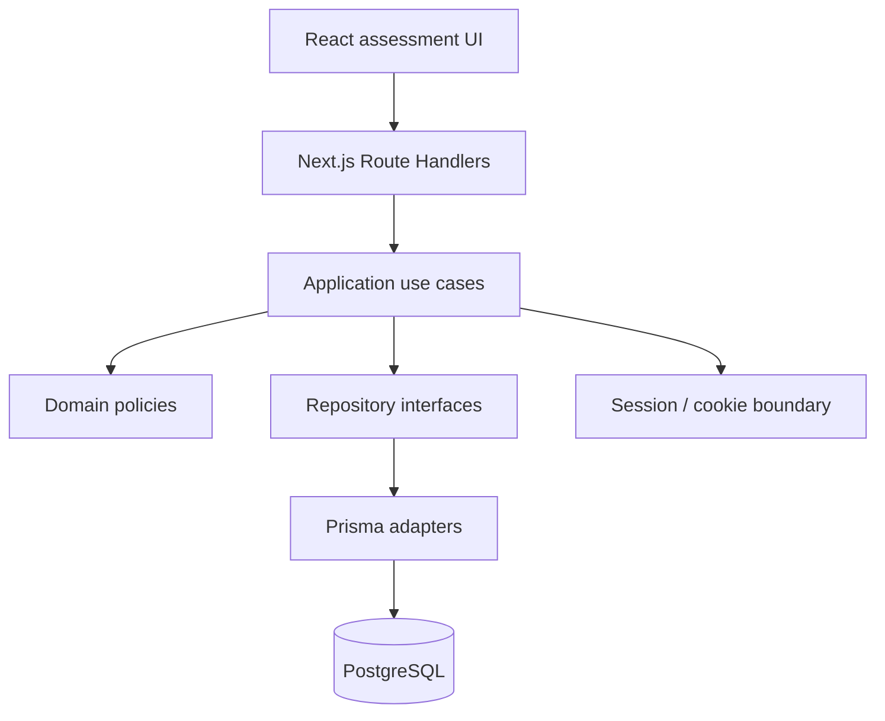
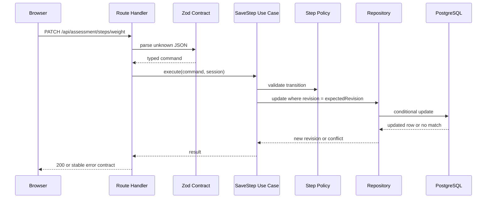
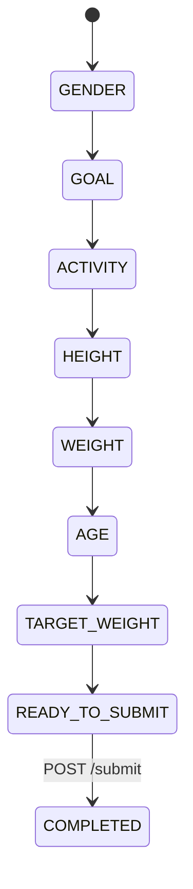
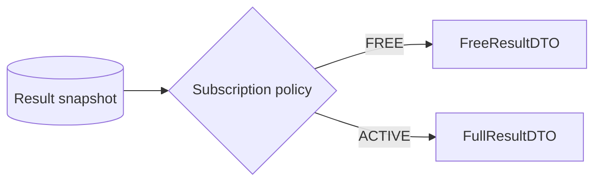

# System architecture

## 1. Architectural style

The project uses a small modular monolith built with Next.js.

This is a deliberate time-box decision: one repository, one application deployment, one CI pipeline, and one database connection reduce integration overhead while still allowing clear boundaries between transport, application, domain, and persistence logic.



## 2. Dependency direction

Dependencies point inward:

```text
app / HTTP adapters
        -> application
              -> domain
              -> repository ports
infrastructure
        -> repository ports
```

The domain layer must not import:

- Next.js;
- React;
- Prisma;
- cookies;
- environment variables;
- wall-clock time directly.

## 3. Implemented source layout

```text
src/
├── app/
│   ├── assessment/
│   ├── result/
│   └── api/
│       ├── session/
│       ├── assessment/
│       │   ├── route.ts
│       │   ├── steps/[stepKey]/
│       │   ├── submit/
│       │   └── result/
│       └── pay/
├── components/
│   └── assessment/
├── contracts/
│   └── api-error.ts
├── modules/
│   ├── assessment/
│   │   ├── application/
│   │   ├── contracts/
│   │   ├── domain/
│   │   └── infrastructure/
│   └── session/
│       ├── application/
│       ├── domain/
│       ├── http/
│       └── infrastructure/
├── lib/
└── test/
    ├── unit/
    ├── integration/
    └── e2e/
```

## 4. UI system and component ownership

The presentation layer uses **Tailwind CSS + shadcn/ui with Base UI primitives**.

shadcn/ui is treated as local source code for shared UI primitives, not as a black-box dependency. The project follows a library-first rule:

1. check whether a suitable shadcn/ui component already exists;
2. add the Base UI-backed shadcn component through the CLI;
3. customize its local implementation or variants when product needs require it;
4. compose assessment-specific components from those primitives;
5. hand-roll a new primitive only when the library does not provide a suitable semantic/accessibility baseline.

```text
Base UI primitive
      -> shadcn/ui local component
            -> project variants/tokens
                  -> assessment-specific composition
```

Examples:

- use shadcn `Button` rather than defining a second generic button system;
- use shadcn `Progress` for the funnel progress indicator;
- use shadcn `RadioGroup` when the question semantics are a single selection;
- use shadcn `Dialog` for the simulated-payment/paywall interaction when a dialog is appropriate;
- build `AssessmentOptionCard` as a product composition on top of shared primitives rather than recreating keyboard/focus behavior manually.

This policy exists to preserve accessibility behavior, interaction consistency, design tokens, and reviewability while still allowing the BetterMe-inspired funnel to have its own visual identity.

## 5. Request lifecycle

Example: saving a weight step.



## 6. Shared contracts and runtime trust

The HTTP boundary uses executable contracts as the single API source of truth. Runtime schemas are defined with Zod and DTO types are inferred from those schemas; browser code does not hand-maintain parallel response interfaces. Success payloads, error envelopes, error-detail variants, and error-code-to-status mapping are all validated rather than trusted by assertion.

```text
domain literal tuples (`as const`)
        |
        v
contracts / Zod schemas
   |                |
   v                v
Route Handlers   browser API clients
(output parse)   (response parse)
```

This deliberately avoids the weak pattern `fetch(...).json() as SomeDto`. A successful HTTP status is not enough: the browser accepts data only after the shared response schema validates it. Compile-only alignment fixtures also compare domain values/fields with generated Prisma types and application projection return types with public DTOs. Contract drift therefore fails in typecheck where possible and fails closed at runtime at the network boundary.

Assessment step/value coupling is represented by one discriminated Zod command union. The inferred command itself carries `{ step, value, expectedRevision }`, so `AGE` cannot be paired with `"MALE"` or `GENDER` with a number. The step order, route-key map, domain validity map, UI question map, and command-to-answer persistence patch are all exhaustively tied to `AssessmentStep`; changing the step set must update each required projection or typecheck/tests fail. The React funnel creates the same command through the shared parser before calling the browser adapter, and the server parses the request with that contract.

## 7. State ownership

### Server-owned state

- anonymous session identity;
- subscription status;
- assessment answers;
- assessment lifecycle status;
- optimistic concurrency revision;
- result snapshot;
- payment-event idempotency record.

### Client-owned state

Only transient presentation state belongs solely in the browser, for example:

- input focus;
- temporary form text before submit;
- animation/transition state;
- local loading/error display state;
- `ANALYZING`, `WELLNESS_PROFILE`, `PROJECTION`, and paywall view transitions.

The browser is never authoritative for subscription or completed assessment state. Resumable answer progress is not stored as a second mutable server field either: it is derived from persisted answers plus domain validation.

## 8. Assessment answer progression

The persisted domain has seven answer steps. `ANALYZING`, wellness-profile, projection, result, and paywall screens are UI/result states and are not persisted assessment steps.



`READY_TO_SUBMIT` is derived, not stored. The server computes `nextRequiredStep` by scanning the ordered step definitions and validating each persisted answer in its current context.

Rules:

- saving the next legal unresolved step is allowed;
- editing an already answered earlier step is allowed while the assessment is in progress;
- changing an earlier answer revalidates dependent later answers; for example, changing `goal` or `weightKg` can make an existing `targetWeightKg` invalid and therefore make `TARGET_WEIGHT` the next required step again;
- later valid answers are retained rather than erased merely because the resolver moved backward;
- skipping an unresolved prerequisite is rejected;
- completed assessments reject answer mutations unless a future explicit restart use case is introduced;
- transition resolution uses semantic step keys, not UI array indexes or a persisted current-step pointer.

## 9. Concurrency model

`Assessment.revision` implements optimistic concurrency control for aggregate mutations.

A client reads revision `N` and sends `expectedRevision: N` with an answer write (and with first-time submission). The mutation succeeds only if the persisted revision is still `N`, then increments it to `N + 1`.

A stale answer write returns HTTP `409` with `ASSESSMENT_VERSION_CONFLICT` even when the submitted value happens to equal the current value. Silent acceptance would hide a stale-client condition and weaken the concurrency contract.

This prevents a delayed tab or duplicate UI from silently overwriting or acting on more recent server state.

## 10. Submission semantics

`POST /api/assessment/submit` is semantically idempotent.

On first valid submit:

1. verify session ownership;
2. verify that `expectedRevision` still matches the in-progress aggregate;
3. derive and verify that there is no remaining required/invalid step;
4. run the selected calculation policy with an injected reference date;
5. create a result snapshot and mark the assessment completed in one transaction;
6. increment the aggregate revision;
7. return the successful state.

On retry after a successful completion, the existing snapshot is returned before applying stale-revision rejection. This preserves true retry safety after a lost response while keeping first-time submission concurrency-safe.

## 11. Result snapshot rationale

Results are persisted rather than recalculated on every read.

```text
Assessment answers
      + reference date
      + calculation policy version
             |
             v
      Result snapshot
```

This makes a completed assessment reproducible and allows future calculation-policy changes without mutating historical results.

## 12. Authorization model

Authorization happens before serialization.



A free DTO does not contain premium values. CSS blur is presentation only and is not considered an access-control mechanism.

## 13. Payment simulation

The challenge uses a simulated payment endpoint rather than a provider integration.

A client/demo `idempotencyKey` is stored in `PaymentEvent` with a uniqueness constraint scoped to the anonymous session. Replaying the same key returns the already-applied outcome and does not repeat subscription side effects. The name is intentional: this endpoint simulates payment behavior and does not pretend to receive a real payment-provider transaction ID.

## 14. Error model

All API failures use a stable envelope:

```json
{
  "error": {
    "code": "STEP_OUT_OF_ORDER",
    "message": "This assessment step cannot be submitted yet.",
    "details": {}
  }
}
```

Stable `code` values are for client logic and tests. Human-readable `message` is not used as a programmatic discriminator.

## 15. Security boundaries

The minimum security posture is:

- anonymous identity in an HttpOnly cookie;
- secure cookie in production;
- SameSite protection appropriate for same-origin flow;
- all assessment queries scoped to the current session;
- no user-controlled `sessionId` authorization shortcut;
- subscription state mutated only by server payment logic;
- Zod validation for network input;
- free result serialization omits locked values entirely;
- no secrets committed to the repository.

## 16. Observability boundary for the challenge

A dedicated observability stack is intentionally outside this three-day scope. Runtime/container request logs are sufficient for deployment smoke diagnosis, while correctness evidence for lifecycle events comes from deterministic tests and persisted state rather than bespoke log assertions.

If this moves toward production, the next observability step would be privacy-safe structured lifecycle events for session creation, step saves/conflicts, completion, payment replay, and result projection. Those events must not contain the session cookie or unnecessary health-form values.
