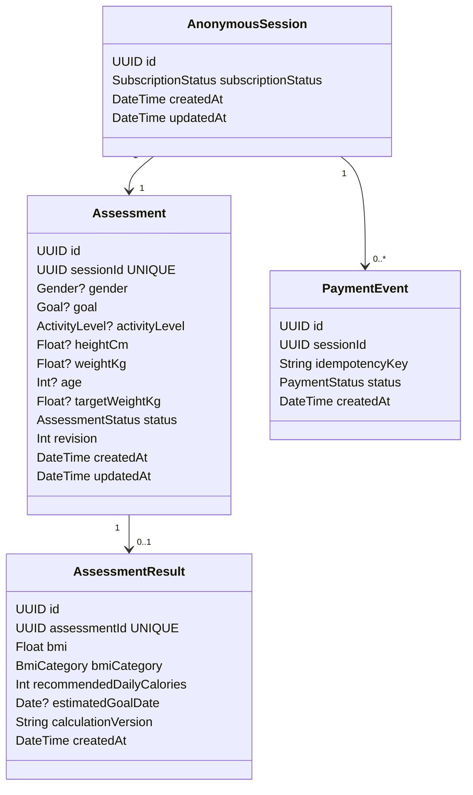

# Domain and data model v0.2

## 1. Domain boundary

The v1 system has one small assessment aggregate plus a subscription/payment boundary. It deliberately avoids modeling reference-funnel presentation screens as domain entities.

Persisted facts:

- anonymous session identity and subscription status;
- seven assessment answers;
- assessment lifecycle/revision;
- one immutable result snapshot;
- payment idempotency events.

Derived/presentation state such as the next screen, analyzing animation, wellness profile view, projection view, and paywall screen is not duplicated in persistence.

## 2. Core persistence model



V1 intentionally enforces one assessment per anonymous session. Restart/history is a future use case, not a requirement to pre-model.

## 3. Proposed enums

```ts
export type SubscriptionStatus = "FREE" | "ACTIVE";

export type Gender = "MALE" | "FEMALE" | "OTHER";

export type Goal = "LOSE_WEIGHT" | "MAINTAIN" | "GAIN_WEIGHT";

export type ActivityLevel =
  | "SEDENTARY"
  | "LIGHT"
  | "MODERATE"
  | "ACTIVE"
  | "VERY_ACTIVE";

export type AssessmentStep =
  | "GENDER"
  | "GOAL"
  | "ACTIVITY"
  | "HEIGHT"
  | "WEIGHT"
  | "AGE"
  | "TARGET_WEIGHT";

export type AssessmentStatus = "IN_PROGRESS" | "COMPLETED";
export type PaymentStatus = "SUCCEEDED";
```

These enum values are implementation design choices; the source challenge does not prescribe the exact enum vocabulary.

## 4. Aggregate root and ownership

`Assessment` is the aggregate whose answer mutations must remain internally consistent. Every load/mutation is scoped through the current `AnonymousSession`; the client never chooses an arbitrary `sessionId` to authorize access.

The aggregate owns:

- answer values;
- lifecycle status;
- optimistic `revision`;
- readiness for submission, derived from its answers.

Subscription status is session-level authorization state, not an assessment field.

## 5. Why progress is derived, not persisted

There is no `currentStepKey` column. Persisting both answers and a mutable progress pointer would encode the same fact twice. A failed or partial update could otherwise produce states such as "activity is already saved but current step still says GOAL."

Instead:

```ts
getNextRequiredStep(assessment): AssessmentStep | null
```

The resolver evaluates answer steps in semantic order and returns the first answer that is either missing or invalid in the current cross-field context. `null` means the in-progress assessment is ready to submit.

This also handles edits correctly. Example:

```text
weightKg = 80
goal = LOSE_WEIGHT
targetWeightKg = 70
        -> ready

edit goal = GAIN_WEIGHT
        -> targetWeightKg is now context-invalid
        -> nextRequiredStep = TARGET_WEIGHT
```

The old target value can remain stored for user convenience, but it cannot satisfy readiness until corrected. Unrelated valid later answers are not erased merely because the resolver moved backward.

## 6. Step-write policy

For an in-progress assessment, a step mutation is allowed when either:

1. it is the current `nextRequiredStep`; or
2. that step already has an answer and the user is editing it.

A later unresolved step cannot be skipped. After any accepted edit, the server recomputes `nextRequiredStep`.

Completed assessments reject answer mutations unless a future explicit restart use case is introduced.

## 7. Target-weight semantics

All seven answer groups, including `targetWeightKg`, are required in v1. We intentionally do not introduce a speculative branch that omits target weight for `MAINTAIN`.

`targetWeightKg` is cross-validated with `goal` and `weightKg`. T07 freezes a deliberately simple product-consistency invariant:

- `LOSE_WEIGHT` requires `targetWeightKg < weightKg`;
- `GAIN_WEIGHT` requires `targetWeightKg > weightKg`;
- `MAINTAIN` requires `targetWeightKg === weightKg`.

This is an implementation rule for keeping the questionnaire internally coherent, not a medical recommendation. It also gives earlier edits meaningful consequences: changing `goal` or current weight can make a previously persisted target invalid, and `getNextRequiredStep()` then derives `TARGET_WEIGHT` again without deleting unrelated later data.

## 8. Optimistic concurrency

`revision` starts at `0` and increments for every accepted aggregate mutation, including first successful completion.

Conceptual answer update:

```sql
UPDATE assessment
SET weight_kg = :weight,
    revision = revision + 1,
    updated_at = now()
WHERE id = :id
  AND session_id = :session_id
  AND status = 'IN_PROGRESS'
  AND revision = :expected_revision;
```

A stale `expectedRevision` is a conflict even if the request happens to contain the same value that is already persisted. The client must refetch instead of silently treating a stale write as current.

First-time `POST /submit` also supplies `expectedRevision` so result generation cannot race with a newer answer write. However, if the assessment is already completed with its result snapshot, submit retries return the existing success before stale-revision rejection; this supports retry after a lost HTTP response.

## 9. Result snapshot

A completed assessment has exactly one canonical `AssessmentResult`, enforced by unique `assessmentId`.

A result contains:

- `bmi`;
- `bmiCategory`;
- `recommendedDailyCalories`;
- `estimatedGoalDate`;
- `calculationVersion`;
- creation timestamp.

Submission creates the snapshot and transitions the assessment to `COMPLETED` atomically. Reads never recompute a completed result from today's policy.

A future requirement could persist a dedicated input snapshot or richer policy metadata. For this challenge, the completed assessment plus `calculationVersion` is sufficient and avoids speculative storage.

## 10. Measurement representation

`heightCm`, `weightKg`, `targetWeightKg`, and `bmi` use regular floating-point values rather than Prisma `Decimal`.

Reasoning:

- these are not financial amounts;
- domain code controls explicit rounding;
- JSON and TypeScript interoperability stays simple;
- using `Decimal` would add conversion/serialization ceremony with little value for this scope.

T06 freezes the following inclusive scalar input bounds as **implementation choices**, not values prescribed by the challenge brief:

| Input | Inclusive range |
|---|---:|
| age | 18–100 years |
| height | 120–230 cm |
| current weight | 25–300 kg |
| target weight | 25–300 kg |

Age must be an integer. Numeric contracts reject out-of-range values before persistence, so invalid requests do not advance the aggregate revision. Cross-field target-weight validity is a separate domain-policy concern and is not implied by these scalar bounds.

## 11. Payment idempotency model

`PaymentEvent` records a simulated successful payment action using a caller-provided `idempotencyKey`. The database target is a composite uniqueness constraint:

```text
UNIQUE(sessionId, idempotencyKey)
```

The field is deliberately not called `paymentId`: this challenge does not integrate a real payment provider and should not imply that the demo key is an external transaction identifier.

Replaying the same key for the same session returns the existing outcome without repeating subscription activation. Only server-side payment application can change `AnonymousSession.subscriptionStatus` to `ACTIVE`.

## 12. Calculation policy boundary

Calculations live in pure domain functions and receive time explicitly:

```ts
calculateAssessmentResult(input, referenceDate)
```

They do not import Prisma, Next.js, cookies, environment variables, or call the wall clock directly.

### BMI

BMI uses the standard metric relationship:

```text
BMI = weightKg / (heightMeters ^ 2)
```

Policy details, thresholds, rounding, and references are frozen in `10-calculation-policy.md` before production implementation.

### Recommended intake

D017 is accepted. `demo-v1` uses Mifflin–St Jeor as a recognizable resting-energy base, project-defined activity multipliers, a ±300 kcal/day goal adjustment, a defensive 1000 kcal/day lower guard, and nearest-10 rounding. The `OTHER` branch uses the arithmetic midpoint of the published male/female constants and is explicitly documented as a demo limitation rather than a physiological claim.

### Estimated target date

D018 is accepted. `demo-v1` uses a deliberately static 0.5 kg/week projection for lose/gain and returns the injected reference date for maintain. The model is intentionally simpler than a physiological dynamic model and is labeled as an estimate/simulation. `referenceDate` is injected so CI remains deterministic.

## 13. Domain functions to implement

The core domain surface should stay small:

```ts
getNextRequiredStep(assessment)
validateStepWrite(assessment, step, value)
validateAssessmentReadyForSubmission(assessment)
calculateAssessmentResult(input, referenceDate)
projectResult(result, subscriptionStatus)
```

Application use cases orchestrate persistence/transactions; they do not duplicate these rules.

## 14. Database constraints to target

The initial Prisma/PostgreSQL schema should express:

- primary keys on all entities;
- unique `Assessment.sessionId` (one assessment per anonymous session);
- unique `AssessmentResult.assessmentId`;
- composite unique `(PaymentEvent.sessionId, PaymentEvent.idempotencyKey)`;
- indexes for ownership/result lookup where not already covered by unique indexes;
- explicit relation delete behavior;
- enum-backed statuses;
- default timestamps and assessment revision.

Useful API errors still come from runtime/domain validation; database uniqueness/relations are the final integrity boundary, not the user-facing validation layer.

## 15. Frozen v0.2 invariants

Before implementation begins, the following are frozen:

- one anonymous session owns exactly one v1 assessment;
- seven answer groups are required;
- progress is derived, never stored as `currentStepKey`;
- presentation states such as analyzing/projection are not domain steps;
- editing earlier answers may invalidate dependent later answers;
- stale PATCH writes are conflicts even when values match;
- first-time submit participates in revision concurrency control;
- successful submit retry returns the existing canonical result;
- result creation and completion are atomic;
- result values are versioned snapshots;
- free result serialization omits premium values entirely;
- payment replay safety uses a session-scoped idempotency key;
- only server logic can activate subscription.

Calculation constants/ranges are intentionally not frozen here; D017/D018 plus RED tests will freeze them before implementation of those policies.
