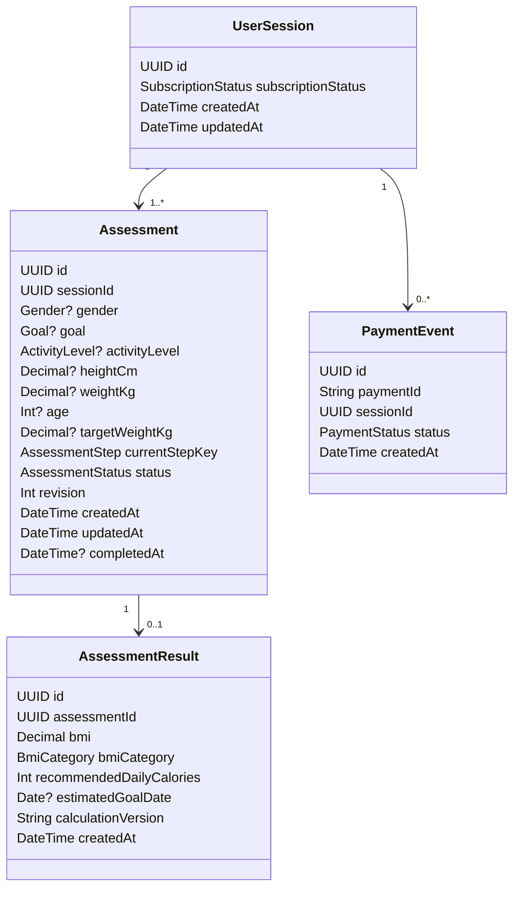

# Domain and data model

## 1. Core entities

The first release uses four core persistence concepts:



A single active assessment per anonymous session may be enforced in v1. The schema can retain one-to-many history if restarting assessments is later introduced.

## 2. Proposed enums

```ts
export type SubscriptionStatus = "FREE" | "ACTIVE";

export type Gender = "MALE" | "FEMALE" | "OTHER";

export type Goal = "LOSE_WEIGHT" | "MAINTAIN" | "GAIN_WEIGHT";

export type ActivityLevel =
  | "SEDENTARY"
  | "LIGHT"
  | "MODERATE"
  | "ACTIVE"
  | "VERY_ACTIVE";

export type AssessmentStep =
  | "GENDER"
  | "GOAL"
  | "ACTIVITY"
  | "HEIGHT"
  | "WEIGHT"
  | "AGE"
  | "TARGET_WEIGHT"
  | "ANALYSIS";

export type AssessmentStatus = "IN_PROGRESS" | "COMPLETED";
```

These values are design choices for this implementation, not asserted as part of the original challenge wording.

## 3. Why explicit columns instead of an answers JSON blob

Explicit columns are preferred because the required input set is small and stable.

Benefits:

- database schema communicates the domain directly;
- validation and nullability are easier to reason about;
- migrations make model changes explicit;
- tests can assert field behavior clearly;
- querying/debugging does not require JSON-path logic;
- accidental acceptance of unknown answer keys is reduced.

A JSON blob would become attractive only if the questionnaire were dynamically configured with many versioned question definitions.

## 4. Step identity

Progress is stored as a stable semantic key such as `WEIGHT`, not a number such as `5`.

This avoids coupling persisted state to presentation order. If a branch is introduced later, `TARGET_WEIGHT` can remain meaningful regardless of where it appears in the current UI sequence.

## 5. Revision semantics

`revision` starts at `0` and increments on each accepted mutation.

Conceptual SQL:

```sql
UPDATE assessment
SET weight_kg = :weight,
    revision = revision + 1,
    updated_at = now()
WHERE id = :id
  AND session_id = :session_id
  AND revision = :expected_revision;
```

No updated row means either the resource disappeared or the revision is stale; the repository/use-case boundary maps this deterministically to the appropriate domain/API error.

## 6. Result snapshot

A result contains both the values and enough metadata to explain how they were produced:

- `bmi`;
- `bmiCategory`;
- `recommendedDailyCalories`;
- `estimatedGoalDate`;
- `calculationVersion`;
- creation timestamp.

A future improvement could store a compact input snapshot or policy metadata if reproducibility requirements become stricter. For the challenge, the completed assessment itself is the source input record.

## 7. Calculation policy

### BMI

BMI will use the standard metric relationship:

```text
BMI = weightKg / (heightMeters ^ 2)
```

Rounding rules and category thresholds will be frozen in tests before implementation.

### Recommended intake

The source brief requires a recommended-intake output but does not prescribe a formula. The exact engineering-demo policy is therefore intentionally **not frozen yet**.

Before implementing it we will add a short decision record covering:

- inputs used;
- constants/formula;
- rounding;
- boundary behavior;
- limitations;
- why the policy is suitable for a software-engineering challenge rather than clinical advice.

### Estimated target date

Likewise, the brief requires a target-date estimate without prescribing the rate model. The implementation will inject `referenceDate` into the pure calculation so tests are deterministic.

## 8. Invariants

The domain should enforce at least these invariants:

- measurements must be finite and within accepted ranges;
- age must be a valid integer in the accepted range;
- a step cannot skip unresolved prerequisites;
- a submitted assessment must contain all fields required for its goal branch;
- a completed assessment has exactly one canonical result snapshot;
- result reads are session-scoped;
- only server-side payment logic can activate subscription;
- duplicate `paymentId` values do not create duplicate effects.

## 9. Prisma constraints to target

The Prisma schema should include database-level constraints where Prisma/PostgreSQL expresses them cleanly:

- primary keys on all entities;
- unique payment identifier;
- unique result per assessment;
- indexes on session ownership lookup;
- relation constraints with explicit delete behavior;
- default timestamps and revision;
- enum-backed statuses.

Input ranges will still be validated in the application boundary because database constraints are not a replacement for useful API errors.
