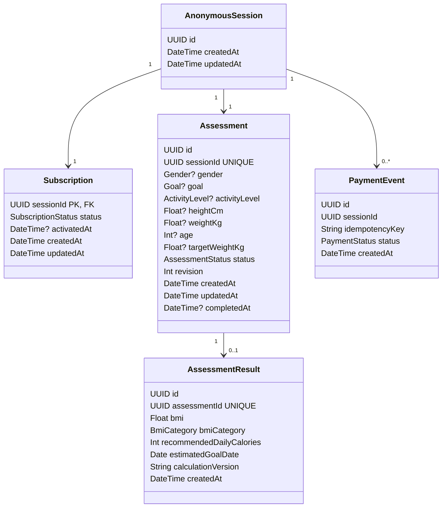

# 领域与数据模型 v1

## 1. 领域边界

v1 系统包含一个小型评估聚合体以及一个订阅/支付边界。系统刻意避免将参考漏斗中的展示页面（presentation screens）建模为领域实体。

持久化事实：

- 匿名会话身份及其 1:1 订阅访问状态；
- 七项评估答案；
- 评估生命周期/版本号；
- 一个不可变的结果快照；
- 支付幂等事件。

派生/展示状态（如下一屏幕、分析动画、健康档案视图、预测视图和付费墙屏幕）不会在持久化层中重复存储。

## 2. 核心持久化模型



V1 刻意为每个匿名会话强制一对一的关系——每个匿名会话仅拥有一条评估记录和一条订阅记录。`Subscription.sessionId` 同时作为主键和外键，使所需的 1:1 关系显式化，无需再发明第二个无意义的标识符。重新开始/历史记录以及真实的计费生命周期属于未来用例，而非需要预先建模的需求。

## 3. 当前枚举值

```ts
export type SubscriptionStatus = "FREE" | "ACTIVE";

export type Gender = "MALE" | "FEMALE" | "OTHER";

export type Goal = "LOSE_WEIGHT" | "MAINTAIN" | "GAIN_WEIGHT";

export type ActivityLevel =
  | "SEDENTARY"
  | "LIGHT"
  | "MODERATE"
  | "ACTIVE"
  | "VERY_ACTIVE";

export type AssessmentStep =
  | "GENDER"
  | "GOAL"
  | "ACTIVITY"
  | "HEIGHT"
  | "WEIGHT"
  | "AGE"
  | "TARGET_WEIGHT";

export type AssessmentStatus = "IN_PROGRESS" | "COMPLETED";
export type PaymentStatus = "SUCCEEDED";
```

这些枚举值属于实现层面的设计选择；原始挑战题目并未规定具体的枚举词汇表。

## 4. 聚合根与所有权

`Assessment` 是聚合根，其答案变更操作必须保持内部一致性。所有加载/变更操作都通过当前 `AnonymousSession` 进行作用域限定；客户端永远不能选择一个任意的 `sessionId` 来授权访问。

聚合根拥有：

- 答案值；
- 生命周期状态；
- 乐观并发版本号 `revision`；
- 提交就绪状态（从其答案派生而来）。

订阅状态属于会话级授权状态，而非评估字段。它存储在专用的 1:1 `Subscription` 行中，并为了应用便利被扁平化到会话读模型中。在读边界处，缺失的订阅行被视为 `FREE`，因此格式错误/手动注入的数据会以失败关闭（fails closed）的方式处理，而非授予高级访问权限。

## 5. 为何进度是派生的而非持久化的

不存在 `currentStepKey` 列。同时持久化答案和可变的进度指针会在同一事实上编码两次。失败或部分更新可能导致如下状态："activity 已保存但当前步骤仍显示 GOAL。"

替代方案：

```ts
getNextRequiredStep(assessment): AssessmentStep | null
```

该解析器按语义顺序评估各答案步骤，返回在当前跨字段上下文中第一个缺失或无效的答案。`null` 表示进行中的评估已准备好提交。

这也正确处理了编辑场景。示例：

```text
weightKg = 80
goal = LOSE_WEIGHT
targetWeightKg = 70
        -> ready

edit goal = GAIN_WEIGHT
        -> targetWeightKg is now context-invalid
        -> nextRequiredStep = TARGET_WEIGHT
```

旧的目标值可以为用户方便而保留存储，但在纠正之前无法满足提交就绪条件。不相关的后续有效答案不会因为解析器向后移动而被删除。

该保留规则适用于上游编辑（例如 `goal`）使已存储的目标值失效的情况。新提交的 `TARGET_WEIGHT` 候选值如果与当前目标/当前体重不一致，则在持久化之前就会被拒绝并返回 `STEP_VALUE_INCONSISTENT`，因此 UI 不会在仍停留在同一未解决步骤时报告保存成功。

## 6. 步骤写入策略

对于进行中的评估，步骤变更在以下任一情况下被允许：

1. 它是当前的 `nextRequiredStep`；或者
2. 该步骤已有答案且用户正在编辑它。

后续未解决的步骤不能被跳过。在任何被接受的编辑之后，服务器会重新计算 `nextRequiredStep`。

已完成的评估拒绝答案变更，除非引入未来的显式重新开始用例。

## 7. 目标体重语义

v1 中所有七个答案组（包括 `targetWeightKg`）都是必需的。我们刻意不引入为 `MAINTAIN` 省略目标体重的投机性分支。

`targetWeightKg` 与 `goal` 和 `weightKg` 进行交叉验证。T07 冻结了一个故意简单的产品一致性不变量：

- `LOSE_WEIGHT` 要求 `targetWeightKg < weightKg`；
- `GAIN_WEIGHT` 要求 `targetWeightKg > weightKg`；
- `MAINTAIN` 要求 `targetWeightKg === weightKg`。

这是保持问卷内部一致性的实现规则，并非医学建议。它也使先前的编辑具有有意义的后果：更改 `goal` 或当前体重可能使之前持久化的目标值失效，随后 `getNextRequiredStep()` 会重新派生出 `TARGET_WEIGHT`，而不会删除不相关的后续数据。

## 8. 乐观并发控制

`revision` 从 `0` 开始，每次接受的聚合变更（包括首次成功完成）都会递增。

概念性答案更新：

```sql
UPDATE assessment
SET weight_kg = :weight,
    revision = revision + 1,
    updated_at = now()
WHERE id = :id
  AND session_id = :session_id
  AND status = 'IN_PROGRESS'
  AND revision = :expected_revision;
```

过期的 `expectedRevision` 即使请求中恰好包含与当前持久化值相同的值，也会被视为冲突。客户端必须重新获取数据，而非静默地将过期写入视为当前值。

首次 `POST /submit` 也需提供 `expectedRevision`，以防止结果生成与更新的答案写入之间产生竞态条件。但是，如果评估已完成并生成了结果快照，提交重试会在过期版本号拒绝之前返回现有的成功结果；这支持在丢失 HTTP 响应后进行重试。

## 9. 结果快照

已完成的评估恰好有一个规范的 `AssessmentResult`，由 `assessmentId` 的唯一约束强制执行。

结果包含：

- `bmi`；
- `bmiCategory`；
- `recommendedDailyCalories`；
- `estimatedGoalDate`（存储为 PostgreSQL 日历类型 `date`）；
- `calculationVersion`；
- 创建时间戳。

提交操作以原子方式创建快照并将评估转换为 `COMPLETED`。读取操作永远不会基于当前策略重新计算已完成的结果。

未来需求可能会持久化专用的输入快照或更丰富的策略元数据。对于本挑战，已完成的评估加上 `calculationVersion` 已足够，避免了投机性存储。

## 10. 度量值表示

`heightCm`、`weightKg`、`targetWeightKg` 和 `bmi` 使用常规浮点值，而非 Prisma `Decimal`。

原因：

- 这些不是金融金额；
- 领域代码控制显式的舍入操作；
- JSON 和 TypeScript 互操作性保持简单；
- 使用 `Decimal` 会增加转换/序列化仪式，而对此范围几乎没有价值。

T06 冻结了以下包含性标量输入范围作为**实现选择**，而非挑战简报规定值：

| 输入 | 包含范围 |
|---|---:|
| age | 18–100 岁 |
| height | 120–230 cm |
| current weight | 25–300 kg |
| target weight | 25–300 kg |

年龄必须为整数。数值契约在持久化之前拒绝超出范围的值，因此无效请求不会推进聚合版本号。跨字段目标体重有效性属于独立的领域策略关注点，并非这些标量范围所隐含的。

## 11. 支付幂等模型

`PaymentEvent` 使用调用方提供的 `idempotencyKey` 记录一次模拟的成功支付操作。数据库目标为复合唯一约束：

```text
UNIQUE(sessionId, idempotencyKey)
```

该字段刻意不命名为 `paymentId`：本挑战不集成真实的支付提供商，不应暗示该示例键是外部交易标识符。

对同一会话重放相同的键会返回现有结果，而不会重复激活订阅。支付事件插入和 `Subscription.status = ACTIVE` 发生在同一个数据库事务中。只有服务端的支付应用才能激活订阅访问。

## 12. 计算策略边界

计算位于纯领域函数中，并显式接收时间参数：

```ts
calculateAssessmentResult(input, referenceDate)
```

它们不导入 Prisma、Next.js、cookies、环境变量，也不直接调用系统时钟。

### BMI

BMI 使用标准的公制关系式：

```text
BMI = weightKg / (heightMeters ^ 2)
```

策略细节、阈值、舍入和参考文献在生产实现之前冻结于 `10-calculation-policy.md`。

### 推荐摄入量

D017 已被接受。`demo-v1` 使用 Mifflin-St Jeor 公式作为公认的静息能量基准、项目定义的活动系数、±300 kcal/天的目标调整量、防御性的 1000 kcal/天下限值以及最近 10 的舍入方式。`OTHER` 分支使用已发布的男性/女性常数的算术中值，并被明确记录为演示限制而非生理学声明。

### 预估目标日期

D018 已被接受。`demo-v1` 使用故意静态的每周 0.5 kg 预测值进行增重/减重预测，对维持体重则返回注入的参考日期。该模型有意比生理动态模型更简单，并被标注为估计值/模拟值。`referenceDate` 采用注入方式以保持 CI 的确定性。

## 13. 待实现的领域函数

核心领域接口应保持精简：

```ts
getNextRequiredStep(assessment)
validateStepWrite(assessment, step, value)
validateAssessmentReadyForSubmission(assessment)
calculateAssessmentResult(input, referenceDate)
projectResult(result, subscriptionStatus)
```

应用用例编排持久化/事务操作；它们不重复这些规则。

## 14. 待实现的数据库约束

初始 Prisma/PostgreSQL schema 应表达：

- 所有实体上的主键；
- 主/外键 `Subscription.sessionId`（每个匿名会话一条订阅记录）；
- 唯一约束 `Assessment.sessionId`（每个匿名会话一条评估记录）；
- 唯一约束 `AssessmentResult.assessmentId`；
- 复合唯一约束 `(PaymentEvent.sessionId, PaymentEvent.idempotencyKey)`；
- 在唯一索引未覆盖的所有者/结果查询处建立索引；
- 显式的关联删除行为；
- 枚举支持的状态值；
- 默认时间戳和评估版本号。

有用的 API 错误仍来自运行时/领域验证；数据库唯一性/关联是最终的完整性边界，而非面向用户的验证层。

## 15. 冻结的 v0.2 不变量

在实现开始之前，以下内容已冻结：

- 一个匿名会话恰好拥有一个 v1 评估；
- 七个答案组为必填项；
- 进度为派生值，永不存储为 `currentStepKey`；
- 分析/预测等展示状态不属于领域步骤；
- 编辑较早的答案可能使后续依赖的答案失效；
- 过期的 PATCH 写入即使值相同也会被视为冲突；
- 首次提交参与版本号并发控制；
- 成功的提交重试返回现有的规范结果；
- 结果创建与完成是原子性的；
- 结果值为带版本号的快照；
- 免费结果序列化完全省略高级功能值；
- 支付重放安全性使用会话范围的幂等键；
- 只有服务端逻辑才能激活订阅。

计算常量/范围在此处故意不冻结；D017/D018 加上 RED 测试将在这些策略实现之前冻结它们。

### 公开订单关联

`Assessment.id` 作为产品流程中使用的不透明 `order` 查询值暴露。它不是承载令牌（bearer secret），没有 API 路由接受它作为授权依据；HttpOnly 匿名会话 cookie 仍然是所有权边界。